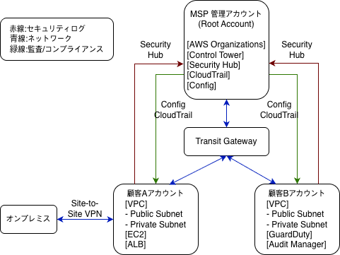

# Topic 1: AWS OrganizationsとControl Towerで作るMSP基盤設計

## はじめに

本記事は実務経験ではなく、学習目的で設計したアーキテクチャをまとめたものです。
私は現場インフラエンジニアとして勤務していました。
オンプレミスの経験を活かしながらAWSクラウド設計を学ぶ中で、
MSP環境におけるマルチアカウント構成を設計してみました。
この記事では、その設計プロセスと各選択の理由をまとめています。

---

## 全体構成図

---

## 設計の理由

### ① なぜアカウントを分離したのか

顧客ごとにセキュリティポリシーやコンプライアンス要件が異なります。
1つのアカウントでセキュリティインシデントが発生した際に、
他の顧客環境への影響を防ぐため、
アカウント単位で分離する設計を選択しました。

### ② なぜTransit Gatewayを中央に置いたのか

顧客が増えるにつれて、VPC Peeringでは接続数が爆発的に増加します。
Transit Gatewayをハブとして配置することで、
新規顧客追加時にTGWへの接続を追加するだけで済むため、
拡張性が高い構成になります。

### ③ なぜSite-to-Site VPNを選択したのか

Direct Connectはコストが高く、構築までの時間もかかります。
初期段階ではSite-to-Site VPNで迅速に接続し、
トラフィックが増加した段階でDirect Connectへ移行する
段階的な戦略を選択しました。

### ④ なぜSecurity Hubで中央集約するのか

各顧客アカウントのGuardDutyの検出結果をSecurity Hubに集約することで、
MSP運用チームが単一の画面から全体のセキュリティ状態を把握し、
対応時間を短縮するためです。

今回は構成をシンプルにするため管理アカウントに統合していますが、
大規模な運用ではセキュリティ専用アカウント（Security Tooling等）を
分離して管理するのがベストプラクティスです。

### ⑤ なぜConfigとCloudTrailで全体監視するのか

AWS Configはリソースの設定状態をリアルタイムで監視し、
コンプライアンス違反を自動的に検出します。
Configのルール評価結果をAudit Managerに取り込むことで、
PCI DSSへの準拠状況を継続的にレポート化できます。

AWS CloudTrailは全アカウントのAPI呼び出しを記録し、
「誰が・いつ・何を変更したか」を追跡します。
セキュリティインシデント発生時の原因調査や、
監査証跡(Audit Trail)として活用できます。

この2つを組み合わせることで、
「何が変わったか(Config)」と「誰が変えたか(CloudTrail)」を
両方カバーする監視体制を実現しています。

---

## まとめ

今回はMSPベースのマルチアカウント構成を設計しました。
次回は顧客AのオンプレミスとAWSを接続する
ハイブリッドネットワーク構成について解説します。

---

## 関連記事

- Topic 2: [オンプレミスとAWSをSite-to-Site VPNで接続するハイブリッドネットワーク構築](../topic2-hybrid-network/README.md)