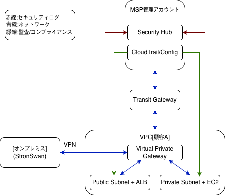

# オンプレミスとAWSをSite-to-Site VPNで接続するハイブリッドネットワーク構築

## はじめに

本記事は学習目的で構築したハイブリッドネットワーク環境をまとめたものです。
私は現場インフラエンジニアとして勤務していました。
オンプレミスの経験を活かしながらAWSクラウド設計を学ぶ中で、
MSP環境における顧客AのオンプレミスとAWSを
Site-to-Site VPNで接続するハイブリッドネットワークを実際に構築しました。
この記事では、構築手順・設計の理由・トラブルシューティングをまとめています。

前回の記事：[AWS OrganizationsとControl Towerで作るMSP基盤設計](#)

---

## 全体構成図



---

## 構成概要

| リソース | 値 |
|---|---|
| VPC (顧客A) | 10.1.0.0/16 |
| Publicサブネット | 10.1.1.0/24 |
| Privateサブネット | 10.1.2.0/24 |
| オンプレミス(シミュレーション) | 192.168.0.0/16 |
| VPNソフトウェア | strongSwan (Ubuntu) |

---

## 設計の理由

### ① なぜEC2でオンプレミスをシミュレーションしたのか

実際のオンプレミス機器がない環境でも、strongSwanをインストールしたEC2が
Customer Gatewayの役割を果たすことで、AWS Site-to-Site VPNの
全体的な接続フローを再現することができます。
AWSの公式ドキュメントでも推奨されている検証方法です。

### ② なぜVirtual Private Gatewayが必要なのか

VPCはデフォルトで外部ネットワークと完全に分離されています。
Virtual Private GatewayはVPNトンネルをVPC内部へ受け入れる「関門」の役割を果たします。
オンプレミス → VPN → **VGW** → VPC の順でトラフィックが流れます。

### ③ なぜDirect ConnectではなくSite-to-Site VPNを選択したのか

Direct Connectはコストが高く、構築までの時間もかかります。
初期段階ではSite-to-Site VPNで迅速に接続し、
トラフィックが増加した段階でDirect Connectへ移行する
段階的な戦略を選択しました。

### ④ なぜPublicサブネットとPrivateサブネットを分離したのか

ALBはインターネットからトラフィックを受け取る必要があるためPublicサブネットに、
実際のサーバー(EC2)は直接インターネットに露出しないようPrivateサブネットに配置しました。
オンプレミスからのVPNトラフィックはPrivateサブネットへ直接ルーティングされます。

### ⑤ なぜTransit GatewayでMSP管理アカウントと接続したのか

オンプレミストラフィックがVPN → VGW → VPCに到達した後、
MSP管理アカウントとの通信が必要な場合、VPC PeeringではなくTGWを使うことで
ルーティングテーブルの管理が中央集権化され、
顧客が増えても構成が複雑になりません。

---

## 構築手順

### 1. VPC作成

```
名前: vpc-customerA
CIDR: 10.1.0.0/16
```

### 2. サブネット作成

```
Publicサブネット:  subnet-public-customerA  / 10.1.1.0/24
Privateサブネット: subnet-private-customerA / 10.1.2.0/24
```

### 3. Internet Gateway作成・アタッチ

```
名前: igw-customerA
→ vpc-customerAにアタッチ
```

### 4. Virtual Private Gateway作成・アタッチ

```
名前: vgw-customerA
→ vpc-customerAにアタッチ
```

### 5. EC2作成 (オンプレミスシミュレーション用)

```
名前: ec2-onpremise-simulation
OS: Ubuntu
配置: Default VPC (vpc-customerAとは別ネットワーク)
```

⚠️ ポイント: オンプレミスEC2はDefault VPCに配置します。
vpc-customerAに入れると同一ネットワークになってしまいます。

### 6. Customer Gateway作成

```
名前: cgw-onpremise
IP: EC2の公開IP
BGP ASN: 65000
```

### 7. Site-to-Site VPN作成

```
名前: vpn-customerA-onpremise
Virtual Private Gateway: vgw-customerA
Customer Gateway: cgw-onpremise
ルーティング: 静的
静的IPプレフィックス: 192.168.0.0/16
```

### 8. strongSwan設定 (EC2上)

```bash
# strongSwanインストール
sudo apt install -y strongswan strongswan-pki libcharon-extra-plugins

# IPフォワーディング有効化
sudo sysctl -w net.ipv4.ip_forward=1
echo "net.ipv4.ip_forward = 1" | sudo tee -a /etc/sysctl.conf

# ソース/デスティネーションチェック無効化 (AWSコンソールで設定)
```

`/etc/ipsec.conf` 設定:

```
conn Tunnel1
    authby=secret
    auto=start
    left=%defaultroute
    leftid=[EC2公開IP]
    right=[トンネル1 AWS側IP]
    leftsubnet=192.168.0.0/16
    rightsubnet=10.1.0.0/16
    type=tunnel
    keyexchange=ikev2
    dpddelay=10
    dpdtimeout=30
    dpdaction=restart
```

### 9. ルーティングテーブル設定

Privateサブネットのルーティングテーブルで
`vgw-customerA`のルート伝播を有効化します。

---

## 通信テスト結果

オンプレミスEC2 (192.168.1.102) から
顧客A VPC内EC2 (10.1.2.151) へのpingテスト:

```bash
$ ping 10.1.2.151 -c 5
PING 10.1.2.151 (10.1.2.151) 56(84) bytes of data.
64 bytes from 10.1.2.151: icmp_seq=1 ttl=127 time=5.50 ms
64 bytes from 10.1.2.151: icmp_seq=2 ttl=127 time=4.39 ms
64 bytes from 10.1.2.151: icmp_seq=3 ttl=127 time=4.43 ms
64 bytes from 10.1.2.151: icmp_seq=4 ttl=127 time=4.41 ms
64 bytes from 10.1.2.151: icmp_seq=5 ttl=127 time=4.41 ms

5 packets transmitted, 5 received, 0% packet loss
```

✅ パケットロスなし、VPN経由での通信確認完了

---

## トラブルシューティング

### 問題1: EC2再起動後に接続できなくなった

**原因**: EC2を再起動すると公開IPが変わるため、
Customer GatewayのIPと不一致になった。

**解決**: Customer Gatewayを新しい公開IPで再作成。

**教訓**: 本番環境ではEC2にElastic IPを割り当てるか、
固定IPを持つオンプレミスルーターを使用する。

---

### ### 問題2: ターミナルでESTABLISHEDなのにAWSコンソールでDOWN

**原因**: EC2のソース/デスティネーションチェックが有効のままだった。
このチェックが有効だとEC2自身が送受信したパケット以外を破棄してしまう。

**解決**: AWSコンソールでEC2の
「ソース/デスティネーション確認」を無効化。

---

## Tunnel 2がDOWNのままで問題ないか？

AWS Site-to-Site VPNは自動的に2本のトンネルを作成します。

| トンネル | 役割 |
|---|---|
| Tunnel 1 | メイン接続 (現在使用中) |
| Tunnel 2 | 冗長化バックアップ |

完全な冗長化にはTunnel 2の設定もipsec.confに追加する必要があります。
今回はTunnel 1のみ設定済みのため、Tunnel 1が切断された場合の
自動切り替えには対応していません。
今後の改善点として対応予定です。

---

## まとめ

今回はオンプレミス環境とAWSをSite-to-Site VPNで接続する
ハイブリッドネットワークを実際に構築しました。

構築の中でEC2再起動によるIP変更やソース/デスティネーションチェックなど、
実際にやってみないと気づきにくいポイントを経験できました。

次回は顧客BのGuardDuty + Security Hub + Audit Managerを使った
セキュリティ監視基盤の構築について解説します。

---

## 参考

- [AWS公式: Site-to-Site VPN とは](https://docs.aws.amazon.com/ja_jp/vpn/latest/s2svpn/VPC_VPN.html)
- [AWS公式: strongSwanを使用したサイト間VPN接続の設定](https://docs.aws.amazon.com/ja_jp/vpn/latest/s2svpn/SetUpVPNConnections.html)